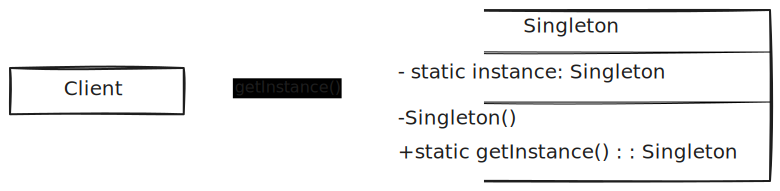

# Padrões de Projeto (*Design Patterns*)

Padrões de Projetos ou *Design Patterns* são soluções comprovadas para problemas 
recorrentes. No mundo do desenvolvimento de software temos os padrões de projetos 
apresentados no livro *Design Patterns: Elements of Reusable Object-Oriented Software*
escrito por *Erich Gamma*, *Richard Helm*, *Ralph Johnson* e *John Vlissides*.

Os 23 padrões de projetos apresentados no livro são divididos em três categorias:

1. Padrões de Criação (*Creational Patterns*)
2. Padrões Estruturais (*Structural Patterns*)
3. Padrões Comportamentais (*Behavioral Patterns*)

## Padrões de Criação (*Creational Patterns*)

## O que são?

São os padrões que focam na **forma como objetos são criados**. Eles encapsulam 
a lógica de instanciação, promovendo maior flexibilidade ao permitir que o 
código fique **independente da implementação concreta** das classes que utiliza.

O objetivo principal é **desacoplar o processo de criação dos objetos do seu 
uso**, facilitando mudanças e promovendo maior reutilização de código.

## Problemas que resolvem

* **Criação direta de objetos** que depende de implementações específicas, 
dificultando a manutenção e evolução do código.
* **Código duplicado** relacionado à instância de objetos com lógica complexa 
de construção.
* **Dependência de classes concretas**, reduzindo a flexibilidade e a 
capacidade de testar.
* **Incapacidade de controlar ou padronizar a criação de instâncias** em 
contextos mais complexos (por exemplo, sistemas com muitas variações de objetos 
ou que exigem controle de ciclo de vida).

## Exemplos de Padrões de Criação

* **Singleton**, garante que uma classe tenha apenas uma instância e fornece 
um ponto global de acesso a ela.
* **Factory Method**, define uma interface para criar um objeto, mas permite 
que subclasses decidam qual classe instanciar.
* **Abstract Factory**, é uma *factory* de *factories*, ou seja, é uma classe 
capaz de criar outras classes. É uma classe que encapsula múltiplos métodos de 
fábrica.
* **Builder**, utilizado para criação de objetos complexos, onde a criação do 
objeto depende de muitos parâmetros. O padrão de design **Builder** desacopla a 
atribuição de argumentos da criação de objetos e permite a construção de objetos 
complexos passo a passo. 
* **Prototype**, utilizado para a criação de objetos ligeiramente diferentes.
Isso é feito clonando um objeto existente e fazendo as alterações necessárias.

## Desvantagens

Apesar de trazerem maior flexibilidade, os padrões de criação também têm 
**desvantagens**:

* **Complexidade de código**, introduzem várias interfaces, classes abstratas 
ou objetos auxiliares, o que pode aumentar o esforço de entendimento.
* **Sobrecarga desnecessária**, para casos simples, aplicar padrões como Builder 
ou Abstract Factory pode ser exagero e resultar em *overengineering*.
* **Dificuldade de depuração**, a criação indireta pode dificultar o 
rastreamento da origem de objetos em ambientes com muitos níveis de abstração.
* **Excesso de classes**, muitos desses padrões requerem várias classes ou 
estruturas auxiliares, o que pode poluir o projeto se não for bem organizado.

## Padrões Estruturais (*Structural Patterns*)

### O que são?

Os **Padrões Estruturais** tratam da **forma como classes e objetos são 
compostos para formar estruturas maiores**. Seu principal objetivo é facilitar 
o **design de sistemas flexíveis e reutilizáveis**, promovendo o baixo 
acoplamento entre os componentes.

Eles se concentram em **como as entidades são conectadas**, facilitando a 
**extensão de funcionalidades** sem necessidade de modificar o código 
existente (aderência ao princípio **Open/Closed**) do SOLID.

### Problemas que resolvem

* **Acoplamento rígido entre classes** que dificulta a reutilização.
* **Designs que não escalam bem** com o crescimento do sistema.
* **Dificuldade em alterar a estrutura interna de objetos** sem impactar o 
restante da aplicação.
* **Incompatibilidade entre interfaces de classes** que precisam trabalhar juntas.

### Exemplos de Padrões Estruturais

* **Adapter**, permite que interfaces incompatíveis trabalhem juntas.
* **Bridge**, separa uma abstração da sua implementação.
* **Composite**, permite tratar objetos individuais e composições de objetos 
de maneira uniforme.
* **Decorator**, adiciona responsabilidades a objetos dinamicamente.
* **Facade**, fornece uma interface simplificada para um subsistema complexo.
* **Flyweight**, compartilha objetos para economizar memória.
* **Proxy**, fornece um substituto ou representante de outro objeto.

### Desvantagens

Embora tragam muitos benefícios, os padrões estruturais também têm **desvantagens**, 
como:

* **Complexidade adicional**: Podem introduzir novas classes e interfaces, 
tornando o sistema mais difícil de entender.
* **Sobrecarga de abstrações**: O uso excessivo pode dificultar a manutenção por 
causa do número de camadas envolvidas.
* **Desempenho**: Em alguns casos, como com `Proxy` ou `Decorator`, pode haver 
uma penalidade de desempenho devido à delegação de chamadas.
* **Dificuldade de depuração**: Quando muitas estruturas envolvem um objeto, 
rastrear a origem de um problema pode se tornar mais difícil.

## Padrões Comportamentais (*Behavioral Patterns*)

### O que são?

Os **Padrões Comportamentais** tratam da **comunicação e interação entre 
objetos**. Eles definem **como responsabilidades são distribuídas** entre os 
objetos e **como eles colaboram** para realizar tarefas, respeitando o baixo 
acoplamento e promovendo maior flexibilidade e reutilização.

Esses padrões ajudam a **encapsular o comportamento** e 
**delegar responsabilidades**, tornando o código mais coeso e fácil de manter.

### Problemas que resolvem

* **Distribuição ineficiente de responsabilidades** entre classes.
* **Acoplamento forte entre objetos**, dificultando a reutilização e testes.
* **Dificuldade em alterar comportamentos** sem modificar o código existente.
* **Falta de flexibilidade nas interações entre objetos**, levando à rigidez do 
sistema.
* **Código com muitos condicionais** para decidir qual comportamento executar.

## Exemplos de Padrões Comportamentais

* **Chain of Responsibility**, passa a solicitação por uma cadeia de objetos até 
que um deles a processe.
* **Command**, encapsula uma solicitação como um objeto, permitindo parametrizar 
clientes com diferentes requisições.
* **Interpreter**, avalia sentenças em uma linguagem, representando sua 
gramática com classes.
* **Iterator**, fornece uma maneira de acessar os elementos de um objeto 
agregado sequencialmente sem expor sua estrutura interna.
* **Mediator**, define um objeto que centraliza a comunicação entre objetos, 
promovendo o baixo acoplamento.
* **Memento**, captura e externaliza o estado interno de um objeto sem violar 
seu encapsulamento.
* **Observer**, define uma dependência um para muitos entre objetos para que, 
quando um objeto mudar de estado, todos os seus dependentes sejam notificados.
* **State**, permite que um objeto altere seu comportamento quando seu estado 
interno muda.
* **Strategy**, define uma família de algoritmos, encapsula cada um deles e 
os torna intercambiáveis.
* **Template Method**, define o esqueleto de um algoritmo em uma operação, 
deixando alguns passos para as subclasses.
* **Visitor**, permite adicionar operações a objetos de uma estrutura sem 
alterar suas classes.

## Desvantagens

Embora úteis, os padrões comportamentais também apresentam **desvantagens**:

* **Aumento da complexidade**, muitos padrões introduzem várias interfaces e 
classes auxiliares, o que pode complicar o projeto.
* **Dificuldade de rastreamento**, a lógica distribuída entre vários objetos ou 
métodos pode dificultar o entendimento do fluxo de execução.
* **Possível sobrecarga de abstrações**, em casos simples, pode ser exagerado 
aplicar esses padrões, gerando código mais difícil de manter.
* **Manutenção complexa**, comportamentos espalhados por múltiplos objetos ou 
delegados a outras classes podem dificultar a depuração e manutenção do sistema.

## Padrões de Criação (*Creational Patterns*)

### Singleton

O padrão Singleton resolve dois problemas:

1. **Garante que classe que implementa esse padrão terá apenas uma instancia.**
Isso permite que o acesso ao um recurso que é compartilhado ou custoso de ser
construído, do ponto de vista computacional, seja criado apenas uma vez. Como
exemplos temos: criação de conexão com o banco de dados, carregar dados do
sistema de arquivos, etc.

2. **Disponibilizar um ponto de acesso global para a instância.** Isso 
quer dizer que a solução instanciada poderá ser aproveita pelo o restante 
da aplicação sem a necessidade de novas instâncias. A ideia é semelhante
ao uso de variáveis globais, mas sem o efeito negativo de alteração de valores
ao longo do fluxo de execução, Singleton protege desse comportamento indesejável.

O uso desse padrão é aplicável nos casos onde é desejável que exista uma única
instância para todos os clientes ou quando precisa ter controle sobre variáveis
globais.

### Diagrama



### Vantagens

* Há certeza que existirá apenas uma instância da objeto.

* Ponto de acesso global para a instância.

* *Lazy Initialization*, o objeto é inicializado apenas quando é requisitado,
na primeira vez.

### Desvantagens

* O padrão poder mascarar um *design* ruim, por exemplo, quando componentes da
aplicação conhecem muito entre si.

* Se for inocentemente implementado pode acarretar em problemas de concorrência
em ambientes *multithread*. O ideal é garantir que o objeto seja imutável.

* Pode ser difícil escrever teste unitários para esse tipo de implementação, por
conta de restrições dos **frameworks** de testes e **mocks**.

### Implementação em Java

#### Solução Ingenua

Abaixo temos um exemplo de uma implementação ingenua de *Singleton*.

```java
public class SingletonNaive {

    private static SingletonNaive instance;
    private final String _data;

    private SingletonNaive(String value) {
        _data = value;
    }

    public static SingletonNaive getInstance(String value) {
        if (instance == null) {
            instance = new SingletonNaive(value);
        }
        return instance;
    }

    public String getData() {
        return _data;
    }
}
```

Em uma situação no qual esse código fosse executado em um ambiente *single 
thread* não haveria problema, a coisa complica quando é executado em um ambiente 
*multithread*, nessa situação não seria possível garantir a existência de uma 
única instância do objeto na aplicação.

#### **Thread Safe**

##### Solução com *synchronized* e *double-checked locking*

Uma forma de resolver essa problema seria adequar o código para ser *thread safe*,
para isso algumas alterações são necessárias, como o uso do *synchronized*,
porém ao adicionar synchronized na assinatura do método irá causar redução no
desempenho da solução, por causa do custo associado a sincronização, porém
esse comportamento é necessário apenas para as primeiras *threads*. Uma maneira
de evitar essa sobrecarga é usando o princípio de bloqueio de dupla verificação.
Nessa abordagem, o bloco sincronizado é usado dentro do *if* com uma verificação
adicional para garantir que apenas uma instância seja criada.

```java
public class SingletonSynchronized {

    private static volatile SingletonSynchronized instance;
    private final String _data;

    private SingletonSynchronized(String value) {
        _data = value;
    }

    public static SingletonSynchronized getInstance(String value) {
        if (instance == null) {
            synchronized (SingletonSynchronized.class) {
                if (instance == null) {
                    instance = new SingletonSynchronized(value);
                }
            }
        }
        return instance;
    }

    public String getData() {
        return _data;
    }
}
```
    
##### Solução com Static Holder Pattern 

Essa implementação faz uso de uma classe privada estática interna que mantém
a instância única da classe externa. Quando a classe externa é carregada a
classe interna não é carregada em memória enquanto não for executado o método
**getInstance()**. Essa é a abordagem elimina a necessidade da utilização de 
sincronização sendo a melhor forma de implementação para Java.

```java
public final class SingletonHolder {
    private final String _data;

    private SingletonHolder() {
        _data = "Singleton data";
    }

    private static final class InstanceHolder {
        private static final SingletonHolder instance = new SingletonHolder();
    }

    public static SingletonHolder getInstance() {
        return InstanceHolder.instance;
    }

    public String getData() {
        return _data;
    }
}
```

### Implementação em Kotlin 

Em Java e outras linguagens, a tarefa de implementar o padrão Singleton é complexa. 
Primeiro é necessário proibir que novas instâncias sejam criadas alterando o 
nível de acesso do construtor para privado, a implementação precisa ser 
*thread-safe* e ter bom desempenho e em alguns casos, garantir que aquela 
instância tenha uma inicialização tardia, *lazy initialization*. 

Em Kotlin algumas dessas preocupações foram resolvidas com uso da palavra chave,
***object***.

* ***object*** tem uma diferença em relação a criação de classes em Java, ele 
não tem construtores, por isso, se for necessário implementar algum tipo de 
inicialização para o **Singleton** que estiver criando, por exemplo, carregar 
dados de um arquivo, isso terá que ser feito com o **init**.

Abaixo temos um exemplo de implementação de um **Singleton** em Kotlin, retirada
do livro *Kotlin Design Patterns and Best Practices*.

Nesse exemplo temos um *Singleton* utilizando uma abordagem de 
*Eager Initialization*, através do bloco **init** para fazer a requisição 
HTTP e armazenar a resposta na variável *response*.

```kotlin

object SingletonHttpClient {

    var response: String = ""
    private set

    init {
        val request = HttpRequest.newBuilder()
            .uri(URI.create("https://www.cheapshark.com/api/1.0/games?id=612"))
            .build()
        val client = HttpClient.newHttpClient()
        response = client
            .send(request, HttpResponse.BodyHandlers.ofString()).body()
    }
}

```

#### Lazy Initialization

Na implementação abaixo o uso da palavra chave **lazy** permite a implementação 
do padrão com a inicialização tardia. 

Observer que essa implementação não é *thread-safe*.

```kotlin

class SingletonLazyHttpClient {
    var response: String = ""
        private set

    companion object {
        val instance: SingletonLazyHttpClient by lazy {
            SingletonLazyHttpClient()
        }
    }

    fun request() {
        val request = HttpRequest.newBuilder()
            .uri(URI.create("https://www.cheapshark.com/api/1.0/games?id=612"))
            .build()
        val client = HttpClient.newHttpClient()
        response = client
            .send(request, HttpResponse.BodyHandlers.ofString()).body()
        println("Response: $response")
    }
}

```
#### Thread Safe

##### Solução com *synchronized* e *double-checked locking*

```kotlin

class SingletonSynchronized private constructor(private val data: String) {
    companion object {
        @Volatile
        private var instance: SingletonSynchronized? = null

        fun getInstance(value: String): SingletonSynchronized? {
            if (instance == null) {
                synchronized(this) {
                    if (instance == null) {
                        instance = SingletonSynchronized(value)
                    }
                }
            }
            return instance
        }
    }
    
    fun getData(): String = data
}

```

##### Solução com Static Holder Pattern 

Essa implementação possui várias características importantes:

* **Construtor privado** para evitar a instanciação direta  
* **Objeto companion** para manter a instância do singleton  
* **Padrão de verificação dupla (double-check locking)** para segurança em 
ambientes concorrentes  
* **Inicialização tardia** (a instância é criada apenas quando necessária)  
* Segurança em múltiplas threads usando **@Volatile** e bloco **synchronized**
- **Desempenho**: Após a criação inicial, não há sobrecarga de sincronização
- **Segurança de memória**: A anotação **@Volatile** garante a visibilidade 
adequada entre threads

> Embora o Kotlin também ofereça a declaração `object` para singletons, o 
padrão Holder oferece **mais flexibilidade** quando você precisa de:

- **Construção com parâmetros**
- **Inicialização tardia**
- **Mais controle sobre o processo de inicialização**

```kotlin

class SingletonHolder private constructor(private val data: String) {

    companion object {
        @Volatile
        private var instance: SingletonHolder? = null

        fun getInstance(value: String): SingletonHolder =
            instance ?: synchronized(this) {
                instance ?: SingletonHolder(value).also { instance = it }
            }
        //Add this method for testing purposes
        fun reset() {
            instance = null
        }
    }

    fun getData(): String = data
}

```
